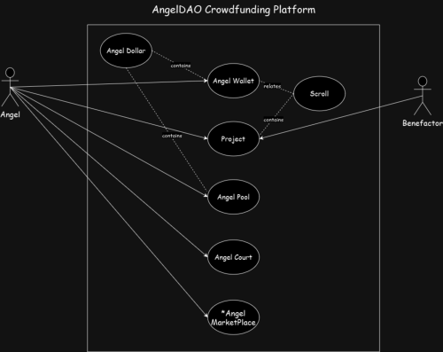

*AngelDAO ...the future of web3-powered crowdfunding*

# Outline

* ### Introduction

* ### Problem

* ### Solution

* ### Components

* ### Architecture

* ### Vision

* ### Mission

* ### Team

## Introduction

### Crowdfunding is not a novel concept and a lot of platforms ([Kickstarter](https://www.kickstarter.com/), [Gofundme](https://www.gofundme.com/), etc) exist to make it so much easier for all involved.
### But these platforms target majorly web2 projects and initiatives, and web3 projects have mostly had to resort to ICOs to raise capital. A solution is needed that caters to both people who want to provide capital for projects, and those who want to fund charitable initiatives.
### AngelDAO is that solution, and we explain how we aim to do these in this article.

## Problem

* ### Web3 crowdfunding suffers from trust gaps between creators and funders

* ### Inadequate project visbility leads to blind investments

* ### Regulatory concerns are a significant challenge

## Solution

### AngelDAO, a universal web3 DAO where:

* ### Projects are thoroughly verified before being uploaded to the DAO

* ### Comprehensive project information is available to all funders to aid funding decisions

* ### Projects are promoted organically, as opposed to hype

* ### A native token designed to minimize flunctuations in value is used

## Components

* ### Angel

### a verified member of the AngelDAO community

* ### Angel Wallet

### Each angel is issued with this after successful verification of KYC details

* ### Angel Dollar

### Native token of the AngelDAO community. Also a stablecoin, which is pegged to the USD in a one-for-one ratio

* ### Benefactor

### Creator(s) of a verified project that is hosted on AngelDAO

* ### Scroll

### Super smart contract that references relationships between angel and project

* ### Angel Pool

### Liquidity pool where angels lock tokens to get voting rights, partake in airdrops, receive community benefits, etc. Locked tokens become governance tokens

* ### Angel Court

### Angels with governance tokens come here to vote on projects to be hosted on the platform, upcoming features, etc

## Architecture

## Vision

* ### Empowering trust and transparency in web3 crowdfunding through AngelDAO, a universal DAO that fosters informed investments and eliminates inherent flaws, creating a more secure and efficient community-funding ecosystem.

## Mission

* ### To establish AngelDAO as a reliable, open, and global DAO, in order to transform web3 crowdfunding. Our goals are to eliminate defects, encourage well-informed investment decisions, and develop a safer and more effective community funding ecosystem that benefits everybody.

## Team

[Chukwubuike Victory Chime](https://github.com/yeahChibyke)

[Lakshay Jamwal](https://github.com/lakshayjamwal108)

[Mohammad Rokib](https://github.com/MohammadRokib)